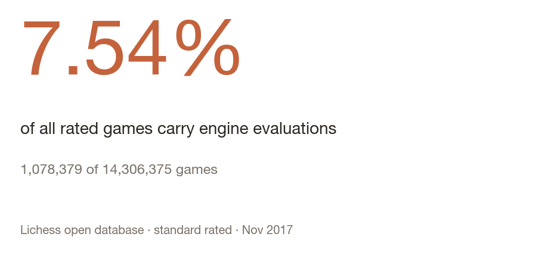
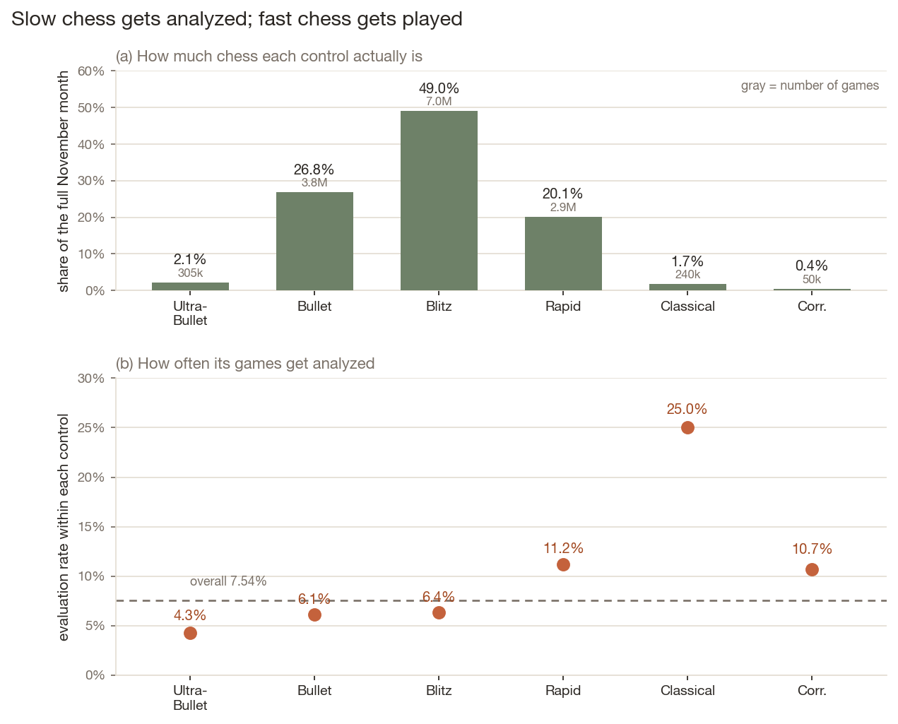
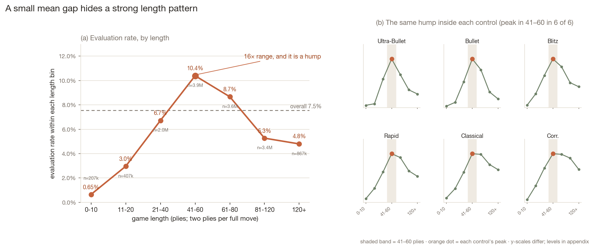
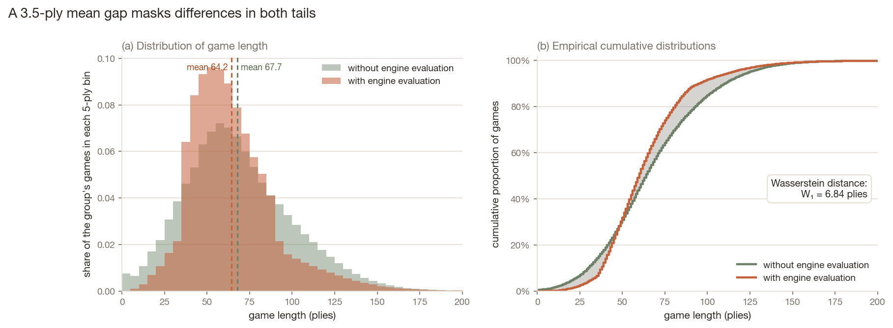

*Data: Lichess open database, November 2017. Full reproduction materials accompany the article.*

## 1. An assumption almost nobody checks

If you have ever studied online chess, you have probably used the Lichess open database. Every month the site publishes every rated game played on it, in PGN format. Some of those games come with engine evaluations: a number after each move saying how good the position is.

Evaluated games are enormously convenient. Blunder rates, conversion of winning positions, how far people drift from the engine line under time pressure: every one of these quantities needs an engine's verdict on every move, and here the verdicts come free. So a lot of research, quite reasonably, reaches for those games.

The problem is that they are **7.54% of the data.**

In November 2017, the month this study uses, Lichess recorded 14,306,375 standard rated games. Exactly 1,078,379 of them carry evaluations. Those 1,078,379 were not sampled at random. A game has an evaluation because somebody clicked "request analysis", typically though not verifiably one of the two players: the file does not record who asked, and spectators or later visitors can ask too. Someone, at any rate, decided this game was worth a closer look. Who clicks, when, and on which games is a chain of human decisions. In methodological terms, this data exists because someone chose to create it.

Data with that property is common, and it usually comes with a curse. Product reviews exist because someone cared enough to write one; the famous bullet-hole diagrams of returning WWII bombers described only the planes that made it home. In such settings the unselected part leaves no record. You cannot compare the people who answered to the people who didn't, so the size of the bias is anyone's guess.

Chess is unusual here: the unselected games are still there. The dump contains every game, analyzed or not. The 13.2 million games nobody asked the engine about sit in the same file with the same fields: time control, both ratings, length, result. For every field the dump records for all games — time control, ratings, length, termination, result — the selection distortion is therefore not something to speculate about: it can be measured directly, by comparing the evaluated subset against the whole, and most of this article is that comparison. What no such comparison can reach are the engine-derived, move-level quantities that exist only inside the analyzed games; their bias cannot be identified from the pre-existing annotations alone, and the article will keep the two categories apart throughout. The question it builds toward: how different is the selected part on what we can see, and can the difference be corrected?

{#fig-hero}


## 2. Which studies inherit the selection problem

One distinction decides whether any of this applies to you. Researchers who use engine evaluations on Lichess data come in two kinds.

- **Those who run the engine themselves.** They choose their games first, then evaluate every one with their own Stockfish. Recent examples include Cüvitoğlu (2026), who evaluated a downloaded sample with Stockfish 14.1, and Elbert et al. (2026), who selected from roughly 273 million games and ran Stockfish 17.1 uniformly. Because the evaluations are generated uniformly after the sample is chosen, nothing about who clicked "analyze" can reach their results. The catch is cost: engine analysis takes real compute per game, studies need millions of games, and that bill is exactly why the second kind exists.
- **Those who use the `%eval` annotations already in the dump.** This saves the entire compute bill and inherits the "who clicked analyze" selection process. *This article is about them.* The practice appears in published and influential work: McIlroy-Young et al. (2020), in a widely cited paper, note that a subset of Lichess games carries high-quality Stockfish evaluations that any player can request, and write that they *"restricted our attention to these games"*, roughly 10% of games in their period.[^1]


## 3. Which games get analyzed

It is worth forming a guess before looking. Out of 14.3 million games, which ones do people actually analyze? Long, serious games? Games between strong players? Close fights that could have gone either way? Keep your guesses in mind; the next three sections check them against the data.

The most direct check is to group the games by their features and ask what share of each group carries an evaluation. Time control is the loudest dimension.

{#fig-controls}

A Classical game is 5.9 times more likely to be analyzed than an UltraBullet game. This is the intuitive part, and the "long, serious games" guess earns its point: a game you sat with for half an hour feels worth a second look; a thirty-second one, what would you even look at?[^2]

The consequences for a downstream researcher are direct. If your dataset is the evaluated games, you believe 5.6% of chess on Lichess is Classical. The true share is 1.7%, overstated 3.3-fold. By the same mechanism you would undercount tournament games (11.3% in the evaluated set against 16.5% in reality) and undercount the games of heavy players (taking, for each game, the mean of its two players' monthly game totals and then averaging over games: 368 for the average evaluated game, 508 for the average game overall: a game-weighted quantity that counts busy players once per appearance, not an average over players, which is far lower).

Time control, then, is loud, and its consequences are mechanical. The next dimension is rating, and rating behaves so strangely that it needs a section of its own.


## 4. The rating gap points the wrong way

Before computing anything, I wrote down what I expected to find, so that hindsight could not quietly rewrite it. One entry read:

> *Stronger players take the game more seriously, so evaluated games should have higher ratings.*

The first look seemed to settle the matter — against me, and not in the way a simple "no" would. The share of games analyzed falls with rating (a game's rating, here and throughout, is the average of its two players' pre-game ratings, in that control's own rating pool) through the entire amateur range: from 10.9% below 1000 to a low of 6.2% around 1800–2000, turning upward only above 2400 to end at 11.3%. Across games below 2400, higher rating goes with a *lower* analyzed share, and games between 1800-and-2000-rated players, people well into chess as a serious hobby, are analyzed least often of all.

{#fig-rating-curve}

::: {.callout-note collapse="true"}
## Why can't some of these bins be trusted?

An early version of this curve nearly fooled me. Binned at 100 points, the 700-rating bin showed a 25% analysis rate, three times the overall rate and apparently a striking find. Printing the bin's games told the whole story: four games, one of which had an evaluation. A bar built on n=4 and a bar built on n=70,000 are drawn with the same width and the same confidence, and the eye cannot tell them apart. With a Wilson interval attached, the n=4 bar spans 4% to 71%, which is to say it says nothing.

I use Wilson intervals rather than the textbook normal approximation for two concrete reasons this dataset supplies itself. The normal interval can dip below zero, an impossible probability, precisely in the thin bins where honesty matters most; Wilson stays inside [0, 1] by construction. And the edge case is real here: 7,592 games ended as `Unterminated`, and zero of them carry evaluations. At k=0 the normal approximation returns an interval of width zero, absolute certainty at the point of least information. The Wilson upper bound is 0.05%. The curve above is built on bins that survive their bounds.
:::

The same wrong sign shows up in the averages. Evaluated games average 1580; the full population, 1621. The evaluated set sits 41 rating points lower (44 against unevaluated games, a **standardized difference**[^t-smd] of −0.16).

When a mechanism this plausible meets a sign this wrong, two explanations came to mind. Perhaps the assumption was simply false, and strong players do not review their games. Or perhaps the quantity I computed is not the quantity I imagined. The second is the cheaper one to check, and Section 3 already supplied a reason for suspicion: which kinds of games get analyzed differs enormously by time control.

::: {.callout-note collapse="true"}
## Why is an "overall average" not what it seems?

Any overall average is a weighted average of subgroups, and the weights can shift along exactly the axis you care about:

$$\text{marginal}(x)=\sum_j w_j(x)\,\text{group}_j(x)$$

If the $w_j$ move with $x$, the marginal curve mixes real within-group trends with changing composition, and it is a faithful picture of neither. Simpson's paradox is this formula at its most extreme; milder versions operate constantly and invisibly.
The worry is not abstract here. The groups are the six time controls, and their weights shift violently along the rating axis: below 1000, more than a quarter of games are Rapid or Classical; above 2400, 96% are Bullet or Blitz. An "average over all games" at a given rating averages over a different mix of chess at every point of the axis.
:::
So I split the 41 points with two thought experiments. Suppose first that, inside every time control, evaluated games were completely typical in rating, and the only difference was which controls get analyzed: whatever gap survives is the composition part. Now suppose instead that the evaluated games matched the site's mix of controls exactly, leaving only the rating differences inside each control: what survives is the within part. The two parts add up exactly to the observed gap, and the accounting is called a **Kitagawa decomposition**[^t-kita]. (The exact formula, and the fact that this is one convention among several — a symmetric one, with other conventions allocating the split somewhat differently — are in the appendix; 24.2% is an accounting allocation, not a law.)

```
Composition (slow controls over-selected)   −9.9 points    24%
Within-control differences                 −31.0 points    76%
─────────────────────────────────────────
Total                                      −40.9 points
```

Only a quarter of the reversal (24.2%, **stability interval**[^t-stab] 22.6–25.8%) comes from the obvious mechanism. That quarter works as follows. Lichess maintains a separate rating pool for each time control, and the pools are not aligned: the median game sits at 1733 in UltraBullet but 1455 in Classical, a 278-point offset that cannot be read as a 278-point difference in strength, because the pools are rated separately and populated by different players. "Average rating" therefore shifts whenever the mix of pools shifts. Classical is simultaneously the most-analyzed control and the lowest-numbered pool, so over-selecting it drags the average down. The mechanism is real but modest.

Three quarters of the reversal happens inside the controls, and there the pattern stops being a nuisance and becomes the finding:

{#fig-interaction .column-page-inset}

Within fast controls, the stronger the players, the *less* the game is analyzed; in UltraBullet, a 2000–2200 game is analyzed a quarter as often as a 1200–1400 one. Within slow controls the gradient runs the other way. The direction reverses between Blitz and Rapid. All six ratios compare the same rating window, so they are on the same scale; intervals are 95% player-resampling stability intervals (B = 200; one seat at a time, wider seat reported; crossed check in appendix). All six exclude 1.

At lower ratings the six controls stay relatively close together. At higher ratings they split sharply: the share falls to a few percent in fast chess and rises toward routine in slow chess. A natural reading is that fast and slow chess support different review cultures. That is an interpretation, not a result: the data shows the split, not its reason.

Because Bullet and Blitz make up 76% of all games, the falling gradients dominate any pooled average. That is what manufactured most of the wrong-way 41 points, and it also dissolves the strange U that opened this section: two opposing gradients, averaged with sliding weights. @fig-gradients shows the dissolution directly.

{#fig-gradients}

::: {.callout-note collapse="true"}
## Why can't we just report "the effect of rating"?

When the direction of X's gradient depends on Z, "the gradient of X" has no referent; only "the gradient of X at a given Z" does. Three consequences follow for the rest of this study. A selection model must include the rating × time-control interaction, because fitting one curve to six curves with opposite signs is misspecification rather than approximation. Any reweighting must balance the joint cells, not rating and speed separately. And no sentence in this article states a marginal rating gradient. Throughout, I say *selection-rate gradient*, not "effect": nothing here identifies a causal quantity.
:::

## 5. A 16-fold structure under a 3.5-ply difference

Game length looked like the least interesting variable in the dataset. Length is measured in plies: one ply is one move by one player, so two plies make one full move. Evaluated games average 64.2 plies; the rest, 67.7. A 3.5-ply gap is the kind of number you file under "nothing there," and on the first pass that is exactly where I filed it.

Then I binned it, and the binning showed what the mean was hiding.

{#fig-length .column-page-inset}

From 0.65% to 10.4% is a 16-fold range, and the shape is a hump. That very short games go unanalyzed surprises nobody; most are not really games, an early resignation or a disconnection. But very long games also go unanalyzed, which I had not predicted. The peak sits at 41–60 plies, a game of normal, complete length. The hump is not an artifact of time control either: it appears, with the peak in the same bin, inside every one of the six controls.

{#fig-ecdf .column-page-inset}

How does a 16-fold structure coexist with a 3.5-ply mean difference? Because the unevaluated group is fatter in both tails. It has 12.5 times the share of games lasting ten plies or fewer (1.55% against 0.12%) and more of the very long games (6.2% against 3.9% beyond 120 plies). The two tails pull the mean in opposite directions and nearly cancel.

Alongside the mean gap, then, this article reports a distributional distance: the **Wasserstein distance**[^t-w1], here 6.8 plies (evaluated versus unevaluated, matching the −3.5 mean gap; the versus-all-games figure is in the published table), twice the mean gap. In one dimension it equals the area between the two cumulative distribution curves, so the shaded region in @fig-ecdf is not an illustration of the number — it is the number.

::: {.callout-note collapse="true"}
## Why is a small mean difference not a small difference?

The mean responds only to the first moment of a distribution; deviations that offset across the two tails are invisible to it, which is exactly what happened here. House rule in this project: core comparisons report a distributional distance alongside the mean gap. The Wasserstein distance is the one reported because of the picture above — the area between the cumulative curves *is* the statistic. The more familiar KS statistic reads off a single point of maximal separation and, at n = 14.3 million, invites misuse as a significance test.
:::

This is the second time in the article that a summary statistic reported "nothing here" while the structure underneath said otherwise. With rating, a pooled curve concealed opposing gradients; with length, a mean concealed a hump. In both cases the summary was accurate but incomplete, and the structure it averaged over was the real result.


*Everything so far treats selection as a property of games: their speed, their rating, their length. Two questions remain. Can these patterns be combined into a correction that rebuilds the full month from the evaluated subset alone? And when the correction falls short, what is the shortfall made of? The repair comes first.*


## 6. Can the difference be repaired?

Sections 3 through 5 measured, one dimension at a time, how the evaluated subset differs from the month it came from: too much Classical, too few tournament games, ratings forty points low, a length distribution thinned at both ends. A diagnosis this specific raises an obvious hope: if we know exactly how the subset is tilted, maybe we can tilt it back. Concretely: using fields recorded for every game, estimate each game's probability of entering the evaluated subset, then weight each analyzed game by the inverse of that probability. The practical point of such weights is not the free fields themselves (the dump already has those for every game) but that the same weights can then be applied to quantities observed only inside the subset.

### Building the weights

The repair idea is old and concrete. Suppose games of a certain kind get analyzed a quarter of the time. Then for every analyzed game of that kind, roughly three more just like it sit in the dump unanalyzed. The analyzed one can be made to speak for all four, itself and the three nobody clicked on: count it four times, and the analyzed games of that kind add up to that kind's true total. A kind analyzed half a percent of the time needs a louder megaphone: each survivor counts two hundred times. Do this for every kind at once, weighting each analyzed game by one over its probability of being analyzed, and, if the probabilities are adequately estimated and every kind retains some analyzed games, the weighted subset reproduces the month's composition in expectation. Survey statisticians call this **inverse-probability weighting**[^t-ipw] and use it to repair samples that did not come out even. In symbols, the weight on analyzed game $i$ is

$$w_i=\frac{1}{\hat\pi_i},\qquad \hat\pi_i=\widehat{P}\bigl(\text{evaluated}\mid\text{control, rating band, length band, tournament}\bigr).$$

Everything hangs on those probabilities, so the first job is to estimate them. I fit a **logistic regression**[^t-logit] to all 14,306,375 games. Its role is modest and worth stating precisely: it combines the characteristics we have been studying (time control, rating band, length band, tournament status, and a control-by-rating interaction, since Section 4 showed the rating gradient reverses across controls) into one estimated probability that a game with those characteristics carries an evaluation. It does not decide which feature is "responsible" for selection; with correlated features and an interaction, no coefficient can carry that weight. It simply learns how often each kind of game got analyzed. Predictors enter as bins, the same bins used throughout, which lets the U-shapes and reversals of earlier sections show up without being smoothed away; the price is that games inside one bin are treated as identical, and that price will be visible shortly. (Coefficients below are read against a reference game, a non-tournament Blitz game rated 1400–1600 of middling length, chosen as the most ordinary profile in the data; the choice relabels coefficients but changes no prediction. Full specification in the appendix.)

The fitted model largely preserves the patterns documented earlier. At the reference rating band, a Classical game has 4.7 times the **odds**[^t-or] of analysis of an otherwise similar Blitz game (95% CI 4.5–4.9), and very short games and tournament games remain less likely to be analyzed after conditioning on the other modeled characteristics. The notable change is UltraBullet. Its raw analysis rate is the lowest of any control, yet for the reference profile its estimated odds are close to Blitz's (0.94, CI 0.86–1.03). This does not show that shortness causes the marginal deficit, and the control-by-rating interaction means the comparison is anchored at one rating band, not all of them; but it does suggest the raw UltraBullet gap is not a story about the format alone. The remaining fifty-odd coefficients are in the appendix table, and none of them is the point here. The model's job is to hand every game a probability; with those in hand, we can build the weights and ask whether the adjustment actually works.

How good is the model overall? Its in-sample **AUC**[^t-auc] is 0.664 (CI 0.662–0.665). AUC answers one narrow question. Hand the model two games at random, one analyzed and one not, and ask it to point to the analyzed one; AUC is how often it points right. A model with nothing to say gets it right half the time, no better than tossing a coin, and scores 0.5; a model that could always tell the two apart scores 1.0. Two-thirds is real signal, well short of certainty. And that is all AUC says. It is not the share of the decision explained, and it does not tell us whether weights built from these probabilities will actually rebuild the month. A model can rank mediocrely and still weight well, or the reverse. Whether the repair works has to be tested directly, and the test has to be designed so that it is allowed to fail.

::: {.callout-note collapse="true"}
## Why AUC and not accuracy?

Accuracy sounds like the natural score for a yes/no prediction, but it needs a threshold (call everything above some probability "analyzed"), and with rare outcomes it flatters models that do nothing. Only 7.54% of games are analyzed, so a model that answers "not analyzed" every single time is 92.46% accurate and perfectly useless: it never finds one analyzed game. Any accuracy number here would mostly be restating the base rate. AUC has no threshold to pick and only asks whether analyzed games are ranked above unanalyzed ones, so the do-nothing model scores 0.5 no matter how rare the outcome, and everything above 0.5 is actual information. That is why this article reports 0.664, and later 0.827, on a scale where useless sits at 0.5 rather than at 92%.
:::

### Testing the adjustment

Here is the trap a careless test falls into. If I check the weights by asking whether the weighted subset now matches the month on time control or rating, I am letting the model grade its own homework: those are exactly the dimensions the weights were built to balance, so success there is the machinery turning, not evidence about the world. The checks I ran instead were set before fitting: a battery of excluded variables, properties recorded for every game but never shown to the model. (I will call these excluded-variable checks; "held-out" would suggest held-out observations, which is not what happens here.) How the game ended (resignation or checkmate, a flag fall, an abandonment), what the result was, and how many games its players played that month. Each is recorded for every game in the dump, so the weighted answer can be compared with the full-month benchmark; none was available to the model, so matching them is not self-grading. One honesty note before the numbers: this is a stress test on proxies. The quantities downstream researchers actually want, blunder rates and evaluation swings, exist only inside analyzed games, so no test of this kind can be run on them. Held-out balance is evidence that the weights transfer beyond their training dimensions; it is not a guarantee for every unmeasured thing.

| Quantity | Full month (benchmark) | Evaluated subset | After weighting | Gap closed |
|---|---:|---:|---:|---:|
| *Shown to the model* | | | | |
| Share Classical | 1.68% | 5.57% | 1.71% | 99% |
| Share tournament | 16.5% | 11.3% | 16.0% | 89% |
| Mean rating | 1621.0 | 1580.1 | 1620.5 | 99% |
| Mean length (plies) | 67.5 | 64.2 | 66.6 | 72% |
| *Never shown to the model* | | | | |
| Players' monthly games (game-weighted) | 508 | 368 | 425 | 41% |
| Ended by time forfeit | 32.8% | 26.5% | 29.4% | 47% |
| Ended normally | 66.8% | 73.5% | 70.6% | 44% |
| Drawn games | 3.78% | 2.53% | 3.07% | 43% |

: What weighting repairs. Quantities the model was shown versus prespecified excluded-variable checks; the gap-closed column is the share of each original discrepancy removed {#tbl-weighting}

{#fig-weighting .column-page-inset}

The top block confirms the machinery turns. These are the dimensions the weights target, so the 3.3-fold Classical overstatement collapsing to nothing and the forty-point rating gap shrinking to half a point are expected, not impressive; the one instructive residual is length, which closes only 72% because seven bins is a coarse ruler and the model is flat inside each bin. The bottom block is the actual result, and the mechanism behind it is worth spelling out. The model never saw termination, results, or the participants' monthly game counts, so the weights cannot target them directly; an excluded variable's gap can close only insofar as that variable travels with things the model does see. Time forfeits are commoner in fast games; the model knows about fast games; so correcting the control mix drags the termination mix partway along. That partway is the finding. Across the nine prespecified excluded-variable checks, weighting closed 29–47% of each discrepancy that was there to close: 41% of the players'-games gap, 44–47% of the termination gaps, 43% of the missing draws, 29% of the small loss-share gap. Two termination categories had essentially no analyzed games to reweight and closed nothing, and one result category had no real discrepancy to begin with; all nine are in the appendix table. The rest is what this particular adjustment failed to recover. I am deliberately not calling it a measurement of "selection on everything else": some of it may be my model's coarseness (bins too wide, interactions not included), some of it selection on things the file does not record; this test cannot apportion blame between the two. What it can say is that after an honest correction on everything observable here, half or more of every fixable excluded-variable discrepancy was still standing.

### Where weighting fails

Two boundary cases sharpen what weighting is and is not. First, the method has a hard floor, and its name is worth learning: weighting can only amplify games that exist in the subset. The two worst categories fail differently. The 7,592 Unterminated games from Section 3 have not a single analyzed member — an empirical zero for this month, not a law of the site, but with literally nothing to reweight their gap closes by 0.0%. The roughly 59,000 Abandoned games have about forty analyzed members: not zero, but overlap too thin to use, and their gap closes by 0.2%. For weighting to work, every kind of game you care about must retain enough analyzed members to stand on (statisticians call this the **positivity, or overlap, condition**[^t-pos]; one category fails it outright this month, the other practically). No cleverness with weights recovers a group the selection process left empty. Second, a repair can injure. Games ended by a rules infraction are about 7 in 100,000 this month, and the raw subset already estimated them essentially correctly; after weighting, the estimate lands at nearly double the benchmark (CI excluding it). The magnitude is trivial, the mechanism is not: weights are estimates, and where the underlying model errs, weighting can push error into a quantity that had none. I listed this failure mode before running the experiment, during the pilot; here it is on the full month. (The weights themselves are well-behaved: no handful of monster weights drives any of this; diagnostics in the appendix.)

So the repair verdict has three clauses. Weighting on observables fixes what observables explain, here 29–47% of the fixable discrepancies on variables it was never trained on; it cannot touch categories that selection excluded outright; and it can quietly damage what was never broken. The residual gaps carry one more message: something that matters for selection is missing from the game-level picture entirely. The next section goes looking for it.


## 7. Selection clusters around players

Section 6 ended with a puzzle. After an honest reweighting on everything visible about the games, half of every fixable excluded-variable discrepancy was still standing, and the least repaired of all was the participants' monthly game count. That row was trying to tell us something. Every result so far has treated selection as a property of games: their control, their rating, their length. But Section 1 already said, in passing, how this data comes to exist: someone clicks "request analysis". Games do not ask to be analyzed; people ask. The file never records who asked (the request can come from a player, a spectator, or anyone opening the game later), but whoever asks, the games a request lands on are always somebody's games. So there is a measurable player-level variable hiding here.

The measurement is simple once one rule is respected. For each game, look up its two players and ask: how often do their *other* games this month carry an evaluation? Average the two answers and call it the game's participants' other-game analysis history (history, for short). The load-bearing words are "other games". If the current game were included in its own players' rates, the feature would contain a piece of the very answer it is supposed to predict, and any test of it would be quietly rigged. I ran the rigged version deliberately, as a check: including the current game inflates the AUC from 0.827 to 0.853. Excluding it, the **leave-one-out**[^t-loo] rule, is what keeps the feature honest.

Before any model, the raw gradient is worth staring at.

{#fig-history}

From 1.7% to 79.5% is a 47-fold range. Time control gave 5.9-fold; game length, at its most dramatic, 16-fold. Nothing about the game itself comes close to what this one fact about its players carries. (Two small bins are omitted: games whose players have essentially no other games, and a curious exactly-zero-history bin that mixes true never-analyzers with players who simply have too few other games to measure; both in the appendix.)

Put the same feature into Section 6's model, binned like everything else, and the in-sample AUC rises from 0.664 to 0.827 (CI 0.826-0.828). In the two-random-games test, the game-features model points to the analyzed game two times in three; add one number about the players and it points right five times in six. Two fences around that number: it is retrospective, within-month discrimination, not a forecast; and it is an incremental comparison — it says this one participant-history variable adds a great deal on top of the game features, not that it would beat them on its own, a model I did not run.

Now the question this section exists to ask: with analysis history held fixed, what remains of the time-control effects? Section 6's headline coefficient was Classical at 4.7 times the odds of Blitz. After adding history, that odds ratio is 0.99 (CI 0.96-1.02). Read it slowly: among games whose participants have the same analysis history, a Classical game is no more likely to be analyzed than a Blitz game, at the reference profile. The 3.3-fold overrepresentation of Classical chess, the most intuitive finding in this article, the one every reader nods along to ("of course people analyze their serious games"), does not survive one player-level variable. The reading that comes most naturally — a deliberate sort of player both chooses slow chess and tends to have games analyzed, so the Classical excess was really about who plays Classical — is one interpretation consistent with this result, not the result itself; its rival appears in the box just below. What the data establish is the reorganization: a pattern that presented as a property of the format is absorbed, entirely, by a quantity measured on the people at the board.

The rest of the hierarchy goes the same way, and then some. Bullet (1.06 before, 1.00 after) and Rapid (1.59 before, 0.96 after) flatten to nothing. The two extremes do something stranger than flattening: UltraBullet, indistinguishable from Blitz in the game-only model, comes out *above* it once history is fixed (1.50, CI 1.41-1.60), and Correspondence drops below (0.59, CI 0.55-0.63). I report both without a mechanism story; at fixed history, the residual differences are real but modest, they flip sign at the two ends of the speed spectrum, and they are anchored, like every coefficient here, at the reference rating band. The honest summary is that conditioning on one participant-level variable does not just shrink the time-control effects; it erases the middle of the hierarchy and reverses its ends.

::: {.callout-note collapse="true"}
## Does the collapse prove the time control does nothing?

No, and the reason is worth owning, because at least two different worlds produce exactly the collapse above. In world A, an unseen player type (a deliberate sort who treats chess as something to learn from) both chooses slow chess and clicks "request analysis"; the format itself does nothing. Analysis history, measured from a player's other games, stands in for that type (a proxy for the common cause, which is what statisticians call a confounder), and conditioning on it removes a format effect that was never real. That is the composition reading used above. But consider world B. Suppose Classical genuinely makes anyone more likely to request analysis, and players specialize: Alice plays almost only Classical, Bob almost only Blitz. Alice's other games are then mostly Classical too, so her history is high partly *because the format works on her*. In that world the history variable already contains the format's accumulated effect, and conditioning on it subtracts the very thing being tested (overadjustment). Both worlds generate the same joint pattern in this file: Classical, high history, and analysis travel together. They are observationally equivalent, and no amount of staring at this month's data separates them. Two things survive the ambiguity. For predicting who clicks, which is all the weighting of Section 6 ever needs, the two worlds agree; they disagree only about why. And the design that could separate them is known, comparing the same player's slow and fast games against each other, but it needs many players who play both in volume, and it is left as future work (Limitations).
:::
Three cautions keep this finding inside its evidence. First, analysis history is measured, not known: a leave-one-out rate is a noisy summary, least stable for light players. On synthetic data built so that a control effect was pure player composition, this pipeline removed about half of the fake effect when handed the noisy proxy and nearly all of it when handed the true history (appendix). That validates the machinery under that scenario; it does not establish the direction of any bias in the real data, where the box's second world is also in play. Second, nothing causal is claimed; the box above develops why this dataset cannot even in principle decide between "players choose formats" and "formats shape players". Third, the AUC is in-sample and the odds ratios are reference-anchored, as before.


This finding speaks to Section 6, but carefully. It identifies a major selector missing from the game-feature model, which offers a plausible account of why the weighting transferred incompletely; no more than plausible, because the deciding experiment (adding analysis history to the weights and rerunning the excluded-variable checks) was not run. It was not run for a reason: the variable is built from the same month's selection outcomes, it is unstable for light players, and its job in this article is diagnosis, not a weighting recipe for others to transport. The diagnosis is enough. Analysis incidence is strongly clustered on players, and any account of who ends up in the evaluated subset that never mentions the people at the board is missing its largest variable. The article opened by asking which games get looked at by the machine. The honest answer, two sections of machinery later, is that the question was aimed one level too low.

{#fig-players .column-page-inset}


## 8. How biased is it? Wrong question, better one available

After seven sections, the honest summary of "how biased is the evaluated subset?" is that the question has no single answer. The distortions measured in this article span everything from none at all to complete absence, and which one applies depends entirely on what a researcher wants to compute. So the useful deliverable is not a verdict but a table.

| If your quantity is... | Evaluated subset | Full month | Distortion | After game-level weighting |
|---|---:|---:|---|---|
| Share of Classical games | 5.57% | 1.68% | 3.3× overstated | repaired (99% closed) |
| Mean rating | 1580 | 1621 | −41 rating points vs the month | repaired (99%) |
| Share of tournament games | 11.3% | 16.5% | 0.69× understated | mostly repaired (89%) |
| Mean game length | 64.2 plies | 67.5 plies | −3.2 plies, hiding a 16-fold hump | mostly repaired (72%) |
| Players' monthly games (game-weighted) | 368 | 508 | 0.72× understated | partially repaired (41%) |
| Ended by time forfeit | 26.5% | 32.8% | −6.3 percentage points | partially repaired (47%) |
| Drawn games | 2.53% | 3.78% | 0.67× understated | partially repaired (43%) |
| White-win share | 49.8% | 49.7% | essentially none | none needed; weighting can even inject error |
| Unterminated games | none analyzed | 0.05% | absent from subset | unrepairable this month (empirical zero support) |
| Abandoned games | ~40 analyzed | 0.41% | nearly absent | unusable overlap (near-zero support) |
| Anything move-level (blunder rates, eval swings) | exists only inside the subset | unobservable | untestable here | untestable in principle |

: Bias by quantity. What the evaluated subset gets wrong, by how much, and how much of it game-level weighting repairs {#tbl-bias-by-quantity}

The last row is the one that matters most and the one this article cannot measure, which is itself the finding: the quantities researchers most want engine evaluations *for* are precisely the ones whose selection bias cannot be checked against the dump, because the unanalyzed games carry no evaluations to compare. Every check in this article runs on the free fields. For move-level work the choice in Section 2 is not a nuance but the whole game: run the engine yourself, or accept that any move-level selection bias remains unknown and cannot be bounded from the existing annotations alone.

For a researcher who still reaches for the `%eval` subset, the table compresses to habits:

1. Say so, and report the share. "We use the 7.5% of games with evaluations" is one sentence, and it was absent from the studies I inspected (a purposive nine, not a sample of the literature; see the note to Section 2).
2. Check your quantity against the free fields. Composition, ratings, lengths, terminations are all computable from the dump for your month; the contingency tables published with this article make it a spreadsheet exercise for November 2017.
3. If your quantity is composition-sensitive, reweight on game features and expect partial repair: near-complete on what the model sees; on the prespecified excluded-variable checks here, 29–47% of each fixable discrepancy.
4. Check support before trusting any weighted number: categories with no analyzed games cannot be conjured back.
5. Read game-level gradients with Section 7 in mind: a "games like this get analyzed" pattern may really be a "people like this click" pattern wearing the game's clothing.


## 9. Limitations

Scope. Everything here is one month of one site: November 2017 on Lichess. The month was chosen for being ordinary, but 2017 predates several interface changes, and the analysis-request culture of 2026 may select differently; re-running the pipeline on a fresh month is the obvious replication, and the code makes it mechanical. Nothing licenses extrapolation to other platforms.

Measurement. Participants' analysis history is a leave-one-out proxy, not a disposition measure: noisy for light players, undefined for 435 games, and mildly pathological in an exactly-zero bin that mixes true never-analyzers with thin histories (appendix). In the composition-only synthetic scenario such noise attenuated the collapse; that validates the machinery under that scenario and does not establish the direction of any bias in the real data. Ratings are pool-specific (Section 4), so "same rating band" means same number, not same strength, across controls.

Model form. The selection model is bins plus one interaction, chosen for having no tunable curvature; its coarseness is visible in the 72% closure on game length. Richer specifications (splines, more interactions) might close the excluded-variable discrepancies somewhat further; they would not change what Section 7 says about where selection lives.

Identification. The collapse of the time-control hierarchy is associational. The box in Section 7 spells out the two observationally equivalent readings; the within-player design that would separate them (the same player's slow versus fast games) is future work, not this article.

Inference. The month is a complete enumeration: point values carry no sampling error, and the intervals throughout are player-resampling stability measures whose construction, calibration, and crossed-clustering check live in the appendix. AUCs are in-sample. The robustness suite is deliberately minimal: dropping Correspondence, the one structurally different control, changes nothing that matters (numbers in the appendix), and alternative bin edges were not explored, a knob-avoidance choice declared in Section 6.

What cannot be limited away. The absence of evaluations on unanalyzed games is not a gap in this study but the structural fact about the data: move-level selection bias is unmeasurable from the dump alone, for anyone, by construction.


## 10. Whose games get looked at

The article opened with a dataset that exists because people chose to create it, and a promise that this particular curse could, for once, be audited. Three guesses died on the way. The rating story refused to be one story: the pooled curve points down where intuition points up, and underneath it fast and slow chess run in opposite directions. Longer games are not analyzed more; both tails go dark and the peak sits on ordinary, complete games. And the biggest one, the guess so natural nobody notices making it: that any of this was organized at the level of games. One number measured on the people at the board absorbs the tidy hierarchy of time controls entirely; whether as cause or as marker, the pattern lives with the players.

None of this says the evaluated games are bad data. It says they are somebody's data: the evaluated subset is a portrait of the players whose games get looked at: it overweights the slow, the occasional, and the people whose chess tends to end up under the engine — whoever pressed the button. Researchers who inherit the annotations inherit that portrait as their denominator. The repair kit is real but bounded: weights recover composition, halve some hidden gaps, and cannot resurrect what selection never touched or verify what only the subset contains.

The dump will do this audit again for any month, and the tables published with this article do it for one. The machine sees only games. Which games reach it is organized, more strongly than by any property of the games themselves, around the people who play them.


## Notes

[^t-logit]: A standard model for yes/no outcomes: it combines group memberships into one probability, on a scale (log-odds) where contributions add. First used in §6.
[^t-ipw]: Weight each selected unit by one over its probability of selection, so the weighted sample stands in for the population it was drawn from. §6.
[^t-auc]: The probability that a randomly chosen positive case is ranked above a randomly chosen negative one; 0.5 means no information, 1.0 perfect separation. §6.
[^t-or]: The odds of an event are $p/(1-p)$; an odds ratio compares two groups' odds, and equal odds give a ratio of 1. §6.
[^t-smd]: A gap in means divided by a pooled standard deviation, so gaps on different scales can be compared; |0.1| is conventionally "small". §4.
[^t-w1]: The average distance probability mass must travel to turn one distribution into the other; in one dimension, the area between the two cumulative curves. §5.
[^t-pos]: For reweighting to be possible at all, every kind of unit you care about must retain analyzed members to stand on. §6.
[^t-kita]: An accounting identity splitting a difference of averages into a composition part (who is in each group) and a within part (gaps at fixed composition). §4.
[^t-stab]: A 95% interval from resampling the month's players: how much the number would move under a different draw of the same player population. Appendix. §4.
[^t-loo]: Compute a player's rate from their *other* games only, so the feature never contains the very outcome it is used to predict. §7.


[^1]: Scope caveat: I inspected nine candidate studies, chosen purposively for their data pipelines, not sampled. The counts describe the inspected set only and say nothing about how common each pipeline is in the literature at large.

[^2]: Lichess classifies games by estimated duration (initial clock + 40 × increment). "Classical" means an estimated 25 minutes or more per player; typical settings such as 30+0 or 30+20 run half an hour to an hour per side. UltraBullet is under 30 seconds total.


## Appendix

### A. Headline-claims audit table (§1–§7)

*Every headline number in the article, with its source.*

| Claim | Value | Table | Script | Scope | Interval |
|---|---|---|---|---|---|
| Share of games with evaluations | 7.54% (1,078,379 / 14,306,375) | `agg_headline.csv` | step1 | full | Wilson |
| Classical vs UltraBullet selection | 25.0% vs 4.3% (5.9×) | `t3_1_rates.csv` | step3 | full | one-way player bootstrap (B=200; crossed check in appendix) |
| Classical share overstated | 5.6% vs 1.7% (3.32×) | `t3_2_composition.csv` | step3 | full | — |
| Rating gap | eval − all: −40.9 (equivalently eval − unevaluated: −44.2 = −40.9/0.9246); SMD −0.157 vs unevaluated | `t4_5_elo_balance.csv` | step4 | full | one-way player bootstrap: −40.9 [−42.8, −39.0] |
| Kitagawa split | 24.2% composition / 75.8% within | `t4_4_kitagawa.csv` | step4 | full | exact identity; means from lossless counts |
| Rating-pool spread | 278 points (medians) | `t4_1_elo_by_speed.csv` | step4 | full | — |
| Composition shift along rating | <1000: >25% Rapid+Classical; 2400+: 96% Bullet+Blitz | `t4_2_grid.csv` | step4 | full | — |
| Six within-control ratios | 0.26 → 3.68, reversal Blitz↔Rapid | `t4_3_crossover.csv` | step4 | full | one-way player bootstrap on log ratio (B=200; crossed check in appendix) |
| U-shape of marginal rating curve | 10.9% → 6.2% (1800–2000) → 11.3% | `t3_4_rate_by_elo.csv` | step3 | full | one-way player bootstrap (B=200; crossed check in appendix) |
| Length means / distance | −3.5 plies / Wasserstein 6.84 | `t5_2_ply_balance.csv` | step5 | full | exact from lossless counts |
| 16-fold hump, peak 41–60 | 0.65% → 10.4% | `t5_1_ply_bins.csv` | step5 | full | one-way player bootstrap (B=200; crossed check in appendix) |
| Hump within every control | 6/6 peaks interior | `t5_4_ply_by_speed.csv` | step5 | full | — |
| Zero-evaluation categories | Unterminated 0/7,592 | `t3_1_rates.csv` | step3 | full | Wilson upper 0.05% |
| Selection-model AUC (in-sample) | 0.664 | `t7_2_model_fit.csv` | step9 | full | one-way player bootstrap, full-pipeline refit (B=200): [0.662, 0.665] |
| Conditional odds ratios (Classical 4.69 at ref band; tournament 0.80 additive; UltraBullet 0.94 n.s. at ref band) | ref = Blitz/1400–1600/41–60/non-tour | `t7_1_model_coefs.csv` | step9 | full | same bootstrap, per-coefficient CIs |
| In-model closure after IPW (machinery check) | Classical share 99.2%; mean rating 98.6%; length 72.4% | `t7_4_threepoint.csv` | step10 | full | gap CIs from same bootstrap |
| Held-out closure after IPW | 29–47% per quantity (fixable median 43%) | `t7_4_threepoint.csv` | step10 | full | same |
| Games-per-player after IPW | 368 → 425 (benchmark 508) | `t7_4_threepoint.csv` | step10 | full | weighted point CI [418, 433] |
| Cannot-fix categories (positivity failures) | Abandoned 0.0039% raw vs 0.412% benchmark; Unterminated absent | `t7_4_threepoint.csv` | step10 | full | flagged absent-in-selected |
| Harm case (M15) | Rules infraction: benchmark 0.0069% → weighted 0.0127% | `t7_4_threepoint.csv` | step10 | full | CI [0.0092%, 0.0162%] excludes truth |
| Analysis-history gradient | 1.7% → 79.5% analyzed (47-fold) across history bins | `t8_4_habit_bins.csv` | step11 | full | descriptive counts |
| AUC ladder (in-sample) | 0.664 → 0.827 adding one participant-history variable | `t8_3_auc_ladder.csv` | step11 | full | one-way player bootstrap: [0.826, 0.828] |
| Classical OR collapse | 4.69 [4.51, 4.88] → 0.99 [0.96, 1.02] | `t8_2_or_collapse.csv` | step11 | full | same bootstrap, both models refit per replicate |
| Hierarchy ends flip | UltraBullet 0.94 → 1.50 [1.41, 1.60]; Correspondence 1.26 → 0.59 [0.55, 0.63] | `t8_2_or_collapse.csv` | step11 | full | same |
| Leak demo (leave-one-out justification) | AUC 0.827 (LOO) vs 0.853 (current game included; invalid) | `t8_3_auc_ladder.csv` | step11 | full | teaching check, not a result |

: Headline-claims audit. Every headline number in the article with its source table, script, scope, and interval method {#tbl-audit}

**Verification chain:** pipeline totals assert against registered constants (step1 exits on mismatch); speed rates cross-checked to two independent legacy implementations, 41/41 exact (`t7_crosscheck.csv`); parser validated against python-chess on a 1,000-game pilot; Wasserstein = eCDF-area identity asserted at runtime; Kitagawa components assert to the exact total.

### B. Methods notes

**Estimand and intervals (whole article).** November 2017 is treated as a complete finite population: the point values are exact descriptions of that month, carrying no sampling error. The intervals answer a stability question — how much a number would move under a different draw of the month's players — and can equally be read as superpopulation CIs under an independent-player sampling model; nothing in the article depends on the second reading. Wherever the article says "CI", read these stability intervals; Wilson bounds on thin bins are the one exception, kept to display small-count instability (the n = 4 bin, the k = 0 category). Games sharing a player are not independent (41.5% of games are repeat pairings; design effects on headline rates run 6 to 34, so no single correction factor exists). All CIs are one-way player-bootstrap intervals: resample the 276,345 players with replacement, weight each game by its owner's draw count, recompute the entire statistic, B = 200; run once with games assigned to their white player and once to their black, report the wider seat; ratio statistics combine on the log scale. The scheme reads a design effect of 1 on synthetic data with no clustering (a calibration that caught and retired a defective earlier scheme), and the white-seat design effect on the headline rate (12.9) independently matches a closed-form estimate (13.2). A crossed-clustering check (white + black − pairing, à la Cameron–Gelbach–Miller) widens intervals by roughly ×1.4 and changes no conclusion.

**Robustness (drop-Correspondence; §9 note).** Dropping Correspondence entirely (50,489 games, 0.35% of the month, but the control where 21.65% of games are degenerate) moves the headline evaluated share from 7.54% to 7.53%, the rating gap from −40.9 to −41.5 rating points, and the composition share of the Kitagawa split from 24.2% to 24.1%; the five remaining within-control ratios are unchanged by construction, and no conclusion moves. Robustness comparisons are point-value only.

**Data and pipeline.** One pass over the 14,306,375-game dump compresses losslessly into contingency tables (~4 MB, published with this article); every §3–§5 headline is recomputed from them and cross-checked 41/41 against two independent implementations; the parser is validated against python-chess on a pilot; distributional identities (Wasserstein = eCDF area; Kitagawa components sum to the exact total) assert at runtime.

**Kitagawa decomposition (§4).** With c indexing time controls, w_c the share of games in control c (evaluated set vs. all games) and m_c the mean rating in control c, the gap splits as

$$\Delta=\sum_c w_c^{\mathrm{ev}}m_c^{\mathrm{ev}}-\sum_c w_c^{\mathrm{all}}m_c^{\mathrm{all}}$$

$$\underbrace{\sum_c\bigl(w_c^{\mathrm{ev}}-w_c^{\mathrm{all}}\bigr)\tfrac{m_c^{\mathrm{ev}}+m_c^{\mathrm{all}}}{2}}_{\text{composition}}\;+\;\underbrace{\sum_c\tfrac{w_c^{\mathrm{ev}}+w_c^{\mathrm{all}}}{2}\bigl(m_c^{\mathrm{ev}}-m_c^{\mathrm{all}}\bigr)}_{\text{within}}\;=\;\Delta,$$

an algebraic identity, asserted at runtime. This is the symmetric (midpoint-weighted) convention, invariant to which set is called the baseline. Sequential conventions — weighting composition by baseline means or by evaluated-set means — allocate the split differently; 24.2% is the symmetric convention's allocation, not a unique decomposition; the symmetric convention is the one reported.

**Selection model and weighting (§6).** Model:

$$\log\frac{\pi}{1-\pi}=\alpha+\beta_{\text{control}}+\beta_{\text{rating band}}+\beta_{\text{length band}}+\beta_{\text{tournament}}+\gamma_{\text{control}\times\text{rating}};$$

654 populated cells, 59 parameters, unpenalized MLE fit by iteratively reweighted least squares; coefficients referenced to a non-tournament Blitz game, rated 1400–1600, 41–60 plies (with the interaction, main effects are contrasts at these reference conditions); full coefficient table with bootstrap CIs in `t7_1_model_coefs.csv`; the fitting identity (predicted analyzed games equal observed analyzed games, column by column) is asserted at every run, worst residual 4 × 10⁻¹⁶. Margins are heavily populated but a few cross-cells are thin. The fallback rule was fixed in code before any output was inspected: a speed-by-rating interaction term is dropped (its games served by main effects) when that margin has zero games, zero evaluated games, or only evaluated games, since its coefficient would otherwise run to a boundary. Two margins trip it: Correspondence below 1000 (no games at all this month — nobody is affected) and Classical above 2400 (exactly two games, both analyzed — two games' predictions, and the weights of those two evaluated games, are served by main effects). At two games in 14.3 million, no headline quantity is sensitive to any reasonable alternative treatment of these cells; the model is best described as a 59-parameter MLE with a declared exception for two empty-or-degenerate interaction cells. AUC is computed in-sample; with 14.3M games against 59 parameters the optimism is negligible, but it is not out-of-sample. Weight diagnostics: largest weight 660 (a cell analyzed 0.15% of the time); Kish effective sample size 753,325 of 1,078,379 (70%) — this reflects weight inequality only, not the player-clustering information loss, which the bootstrap handles separately; the heaviest 1% of weights carry 4.5% of the total. Intervals: one-way player bootstrap, B = 200 per seat (games assigned once to their white and once to their black player, wider seat reported), with the entire pipeline, model refit included, inside every replicate; 400 refits in all, 0 unconverged; the identity-weight path reproduces every point estimate with zero drift. Games-per-player is treated as a fixed covariate of the game (measured in the real month), not re-derived inside replicates. The cell table `t7_3_cells.csv` allows any weight to be recomputed by hand as 1/p̂.

**Participants' analysis history (§7).** Definition ("habit" in earlier drafts): per game, the leave-one-out share of each seat's player's other games that carry evaluations this month, averaged over the two seats:

$$h_g=\tfrac12\left(\frac{E_{w(g)}-e_g}{N_{w(g)}-1}+\frac{E_{b(g)}-e_g}{N_{b(g)}-1}\right),$$

where $N_p$ and $E_p$ are player $p$'s games and evaluated games this month and $e_g$ is the current game's own evaluation status. The variable does not identify who requested any analysis; the PGN records no requester, and requests may come from non-participants. Entered as fixed bins (0%, 0-5, 5-10, 10-20, 20-50, 50-100%, no-history), reference = exactly 0%. 435 games (0.003%) have no history on either seat. The exactly-0% bin (20,706 games, 3.1% analyzed, above the 0-5% bin's 1.7%) mixes genuine never-analyzers with players whose few other games make the rate uninformative; a measurement artifact, not behavior. History values and bin edges are fixed on the point data and treated as covariates inside the bootstrap (same convention as games-per-player). Both models are refit inside every replicate (B = 200 per seat, 400 refits, 0 unconverged; score equations assert at 4 x 10^-16). Leave-one-out justification: deliberately including the current game inflates in-sample AUC by +0.026 (real data) and +0.16 (synthetic). Collapse validation on known ground truth: on synthetic data where the control effect was pure player composition, the spurious Classical odds ratio read 1.66 with no history term, 1.25 with the LOO proxy, and 1.05 with the true (oracle) history binned identically — the implementation recovers composition fully when measurement is clean, and in that composition-only scenario the noisy proxy attenuates the collapse. This validates the pipeline under that scenario; it says nothing about the direction of any bias in the real data.

### C. Exact tables behind the figures

| Time control | Games | Share analyzed | vs overall |
|---|---:|---:|---:|
| UltraBullet (< 30s) | 304,569 | 4.3% | 0.57× |
| Bullet | 3,831,325 | 6.1% | 0.81× |
| Blitz | 7,009,403 | 6.4% | 0.84× |
| Rapid | 2,870,138 | 11.2% | 1.49× |
| **Classical (slowest live)** | 240,451 | **25.0%** | **3.32×** |
| Correspondence | 50,489 | 10.7% | 1.41× |

: Evaluation rate by time control (exact values behind @fig-controls) {#tbl-c1}

| Within… | Selection-rate ratio, rating 1200–1400 → 2000–2200 | Direction |
|---|---:|---|
| UltraBullet | 0.26  [0.22, 0.30] | falling |
| Bullet | 0.30  [0.28, 0.31] | falling |
| Blitz | 0.86  [0.82, 0.89] | falling |
| Rapid | 2.39  [2.30, 2.49] | rising |
| Classical | 2.50  [2.33, 2.68] | rising |
| Correspondence | 3.68  [2.83, 4.77] | rising |

: Within-control rating ratios (exact values behind @fig-interaction) {#tbl-c2}

| Length (plies) | Share of games | Share analyzed |
|---|---:|---:|
| 0–10 | 1.4% | **0.65%** |
| 11–20 | 2.8% | 3.0% |
| 21–40 | 14.2% | 6.7% |
| **41–60** | 27.0% | **10.4%** |
| 61–80 | 24.8% | 8.7% |
| 81–120 | 23.7% | 5.3% |
| 120+ | 6.1% | 4.8% |

: Evaluation rate by game length (exact values behind @fig-length) {#tbl-c3}

| Participants' analysis history | Games | Share analyzed |
|---|---:|---:|
| 0-5% | 6,605,029 | 1.7% |
| 5-10% | 4,801,713 | 5.5% |
| 10-20% | 2,084,886 | 16.3% |
| 20-50% | 741,585 | 43.1% |
| 50-100% | 52,021 | 79.5% |

: Evaluation rate by participants' analysis history (exact values behind @fig-history) {#tbl-c4}

**AI assistance.** Code development and visualization were assisted by generative AI; the study design, estimand choices, pre-registered hypotheses, validation checks, interpretation, and final claims were decided and reviewed by the author.
